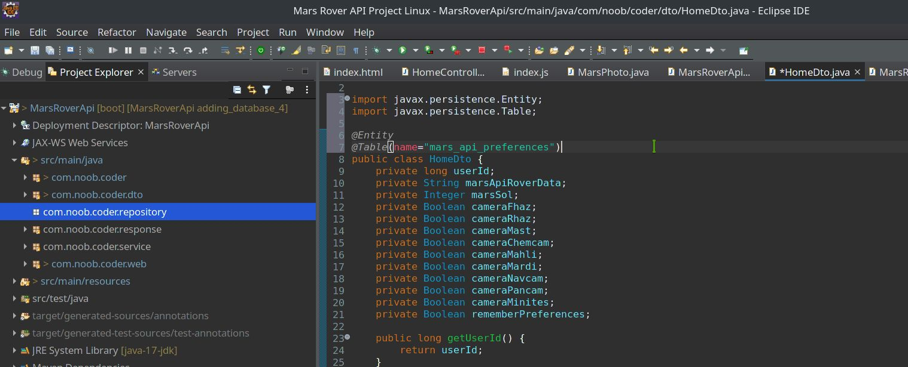
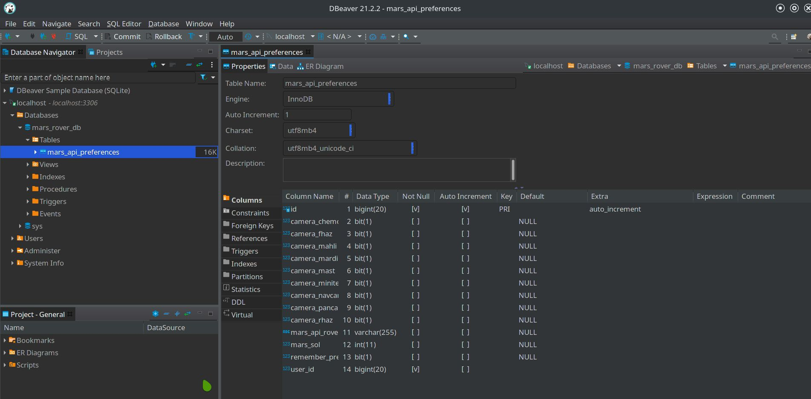
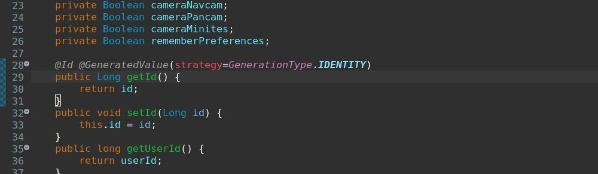

## Browser view of the Mars Rover API images

## What are we trying to achieve?

- When we say submit it will pass all the information about marsSol and other checkboxes in the url to the java server or backend. Java server will intercept the fact that we have rememberPreferences turned on or true. When its turned on, it can try to see if the person who has set rememberpreferences already has some id in the database already. We will store different id for different users? How do we do that?
- We will use Local Storage mechanism in javascript introduced in HTML5 long before. We will generate an id if the person doesn't already have one, in the backend in the server side in the database, and send the id back to the frontend via the model. Then we load up the model, we can store that id on the local storage, next time we press submit, it will submit that id along with the request and use that id to store data in the database.

- We are going to store the homeDto values. This is going to be our sort of a database table with a identifier for each row to uniquely identify the user.

- We are creating a user system without having username and login. We will just have it remember whichever device we are using, it will remember it on. There is no way to tie all the device in one user id unless we use username and login. It will remember the preferences for each device individually. 

## What are localStorage in javascript?

- The localStorage read-only property of the window interface allows you to access a Storage object for the Document's origin; the stored data is saved across browser sessions.

[Source Link](https://blog.logrocket.com/localstorage-javascript-complete-guide/)

## What does the @Entity annotation tell?

- @Entity comes from Java Persistence API. Hibernate is the implementation of the JPA specification. Its like JPA is the interface and Hibernate is the class that implements the JPA interface. 

- This @Entity says this is a database table, we are going to be using this like a database table. By default, this is going to create a table called Home_Dto according to our class name HomeDto.

## Changing the default table name created using @Entity Annotation

- We need to change this default name. We will use @Table annotation to do that.

- When we reboot our server it will create a table called mars_api_preferences in our database with all the properties of the class. 

## Adding Primary Key to our Database Table

- The problem is every database table needs a unique way to identify every single row in the table. We need to be able to pick a single row of data. 
We use ids, primary key to identify a single row of data, a unique number to each row.

- We need to tell hiberate which one of these properties is the primary key.

- We can put it above the attribute definition or the getter method. But, we need to be consistent where to put annotation in the same class. We can't mix match where we put our jpa annotation.

- We also need to tell how to assign ids(primary keys) to our rows.

- This strategy identity says that it uses the built in process that RDBMS mysql system. For mysql its auto increment, it will automatically increment. always increments. No other reason to use other than IDENTITY in normal case.

## Comparing our Entity with Datatype in the Database Table

- Notice the data type in sql table. PRI, auto increment. cameras are bits.

- varchar 255 for mars_api_roverdata. We can overwrite the length in the homeDto using @Column annotation in the getter method.
We do this to save space in our database. 

