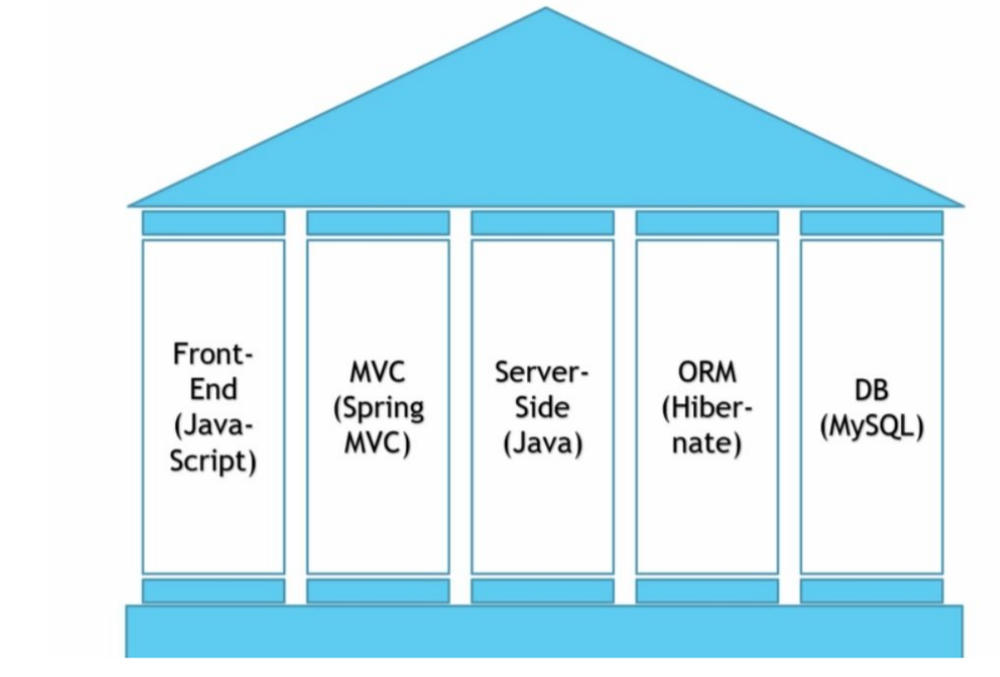
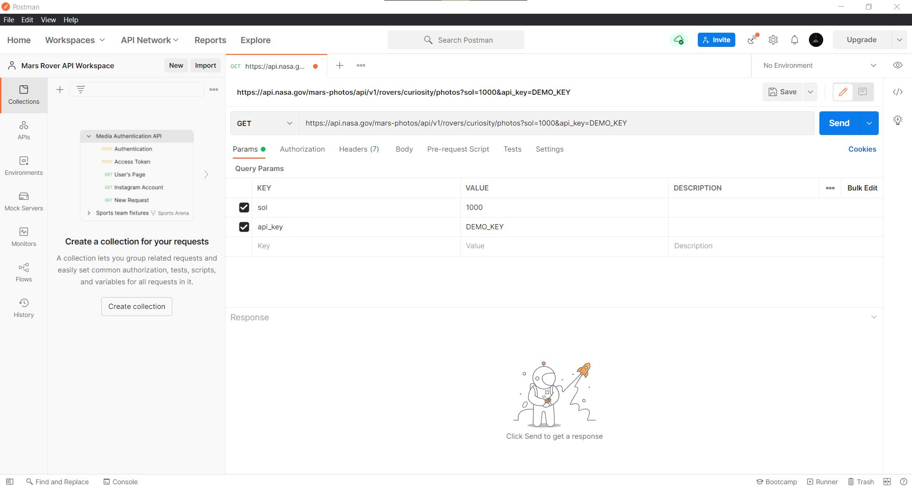

## Five Pillars of Full-Stack Developer Skillset

## What is an API?

- API is just a way for one program to talk to another. Some API allows only to read data whereas some API allows to read/write/update/delete data.
- Two programs, that speak different languages means, for eg: Say you have Java and C++ which are completely different languages, but they agree upon one standard in which they can communicate with each other.
- RESTful API, JSON based on Javascript are how a data is described for an API.
SOAP and XML are slowly becoming relegated to legacy applications.
- We are going to be leveraging the Nasa API. They release publicly available information and details on how we can communicate with essentialy their database.
Database in this case is holding a pictures of mars rover data. They are categorized and we can do lots of things with this data.

[NASA Open APIs](https://api.nasa.gov/)

## Details about APIs

- We are simply querying other's database using API. They will return the data in a JSON format.
- We need to authenticate with APIs. Through a API key or through different ways like OAuth etc. Sometimes its hard and we need to figure out through emailing the respective company providing the API. 
- They have Rate Limiter. We can only use that API key, once every 30 seconds or similar.
- Raw Data is useful if we can take it in parse it, format it, organize it in a way that is human redeable.
- Different ways to authenticate with API lie OAuth or OAuth2 etc. Sometimes its hard and we need to figure out through emailing.
- Postman is a good tool for working with APIs. Makes it easier. Just like using an IDE for programming.

## Details About Postman

- Creating new workspace and We are issuing different http request type to urls and populating it with params, authorization, header, body details in order to get a response. Sending request and getting response.
-Once we copy the address from API link to postman we can see it prepopulates some parameters
?param=value is a query parameter
- There is also authorization tab that helps to authorize our API through different means OAuth, API etc. These are complex and need to be studied.
- Headers means what kind of data we are expecting back.
- If we have body data to send along we use this tab otherwise GET request doesn't have body data.
- For later steps when working with java, We are going to create java objects that mimic the data structures we are getting back, java objects is created to hold the data that is passed to us from nasa. Right now this data is a JSON structure. Therefore, API is way to communicate with languages, language angnostic.
- JSON to Java Object translation. To make data meaningful. Using that data in Java Environment. Step of using postman makes this little bit easier cause we can see how data comes back to us and how we should structure our java objects.

