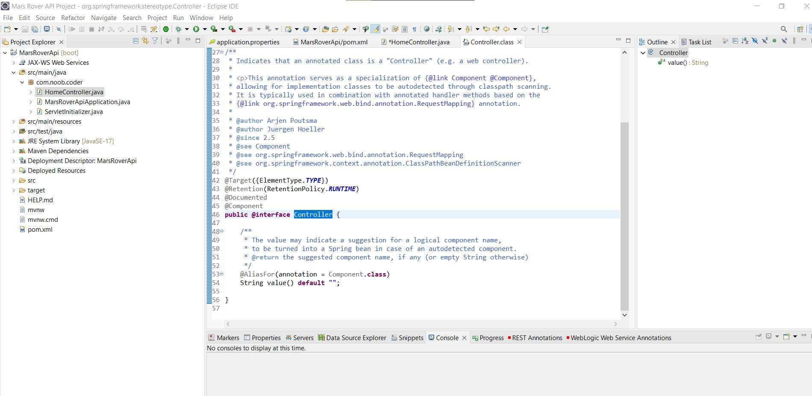

## 4 important properties for application.properties

```
spring.datasource.url=jdbc:mysql://localhost:3306/mars_rover_db
spring.datasource.username=root
spring.datasource.password=root
spring.jpa.hibernate.ddl-auto=update
```

- Since we specified using mysql database we must have some configuration to some database. In application.properties we will populate it with properties on where to connect to the database.
- port 3306 is default for mysql database. db_example is the name of the database we are trying to connect to. Setup your own database. Username and Password.
- spring.jpa.hibernate.ddl-auto= tells hiberate how to deal with the database when we are booting up our application. We have four different values here. One is create, Everytime we boot up. It will drop old database table and creates new table when we restart our server. This is good for first starting our application. Its good for development phase. Very dangerous for live web application if we are making changes to our database schema. 
- create-drop, will delete the table as soon as we stop our server Vs deleting table when we drop our server.
- none, if we want to manage our own sql server, and we don't want hibernate or JPA to manipulate our database. We want to be in full control of our database. Common scenario in real life.
- update, if we don't want to handle script, maintain table. This checks to see if there has been any changes to our table based on the setttings. These settings means hibernate, based on what information? Entity and other stuff, hibernate. Scans for any changes in our java code that pertains to a database table, if there are any changes then it will update the schema for us automatically without us having to write any script. This option will never delete tables. If it detects a brand new table in java, it will create it for you.

## Annotating a class with @Controller

- As we can see @Controller consist of internal annotation @Component. When we mark something as a @Component, Spring is now aware of it, it is visible to spring and Spring will take control of it and manage it as best as it can.
- @Controller here is a specific type of @component that gives us some more feature. A Controller in MVC listens for incoming http requests(get,post,delete) and take those requests and execute the codes.
Very powerful.



