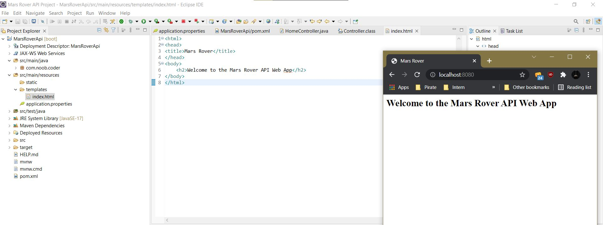

## Browser view of the Mars Rover API images


## What Controller does?

1. Accepts the request
2. Decides what code to execute 
3. Sends to the service
4. Gets the response from the service
5. Sends the response back to the model back to the view.

## Organizing classes in different packages

- service package is used when we have multiple controllers that need to do the same thing. 
Say Home Controller and Dashboard Controller need to perform the same functionality. Instead of same code copied into two places. We take that code out of both controller and we put it in a service. Good for getting rid of code duplication. Extracting the business logic and putting it in the service classes. Service is for ease of use to change technology. Flexibility. Say you want to switch from hibernate for ORM. It makes it easy to switch to different technology. 
- We should reduce the amount of business logic in your controller. Controller should really only handle listening for requests and calling a service. We get a response back from ther service and we send the response back to the front end. If we include business logic in Controller, there is more chance that we would have duplication of code.
- repository package are for accessing the database. 

## Auto instantiating Service class in Controller
We don't need to instantiate the service like:
```
rover = new MarsRoverApiService()
```
because Spring does that for us. This is part of spring framework.

We use the annotation @Autowired. We are telling spring with this annotation that this particular object or service is managed by spring. Hey spring give us this objec that you have already instantiated on our behalf. 

## Manipulating the Response data using thymeleaf

- We can see we are using foreach loop. Here roverData.photos gives array of MarsPhoto and we are going to iterate through each photo. And we are using the link of each photo in th:src.

- We need to use spring expression language to use code expression. We need to use th to augment the source. Without th in the front we can't use ${} spring spring expression language. Here we can see all the pictures that we got back from using the NASA API.

## Response


## Service


## Controller


## View

